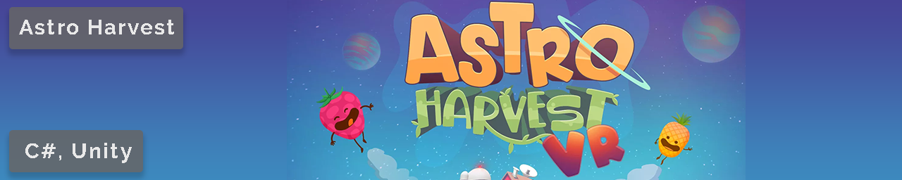

# Astro Harvest
Astro harvest is a project I'm currently working on, for Mantis Games, with a group of 2 artists, 3 game developers and 1 all-rounder. It's a VR game where you farm fruits, place turrets, man them with the fruits and upgrade to defend your base against alien invaders. The game is being developed for the Oculus Quest which comes with its own challenges for development. 
A major challenge at the start was not being able to use the Oculus Link to directly test and debug through Unity. Always having to build to the device was losing us a lot of time. Eventually an update came out that fixed the issue which made testing a lot fast/easier.

## AI - Behaviour Tree
For the AI I decided to create a behaviour tree system as during the prototyping phase it became quite chaotic. I decided to go with a code-driven behaviour tree because of time restrictions. Assets from the asset store were considered but dropped because of the learning curve, price and for the experience gained by creating my own.
The basic behaviour tree system is in place with 2 composite nodes, 1 decorator (might add 1 more) & 1 generic leaf node.

### Base Node & blackboard
```c#
public abstract class BTNode
{
    protected BTNodeStates _nodeState;

    public BTNodeStates NodeState
    {
        get { return _nodeState; }
        private set { _nodeState = value; }
    }

    public BTNode(){}

    public abstract BTNodeStates Execute(BTBlackboard blackboard);
}

public class BTBlackboard
{
    private Dictionary<string, object> _data = new Dictionary<string, object>();

    public BTBlackboard() {}

    public bool GetData<T>(string name, out T value )
    {
        if (_data.ContainsKey(name))
        {
            value = (T)_data[name];
            return true;
        }

        value = default;
        return false;
    }

    public bool AddData<T>(string name, T value)
    {
        if (!_data.ContainsKey(name))
        {
            _data[name] = value;
            return true;
        }
        
        return false;
    }

    public bool ChangeData<T>(string name, T value)
    {
        if (_data.ContainsKey(name))
        {
            if (_data[name].GetType() == value.GetType())
            {
                _data[name] = value;
                return true;
            }
        }
        
        return false;
    }
}
```

### Composite Nodes
Only the basic 2 have been implemented for now as I don't see us needing others for the scale of this project.
```c#
public class BTSelector : BTNode
{
    protected BTNode[] _nodes = default;

    public BTSelector(params BTNode[] nodes)
    {
        _nodes = nodes;
    }

    public override BTNodeStates Execute(BTBlackboard blackboard)
    {
        foreach (BTNode node in _nodes)
        {
            switch (node.Execute(blackboard))
            {
                case BTNodeStates.FAILURE:
                    continue;
                case BTNodeStates.SUCCESS:
                    return _nodeState = BTNodeStates.SUCCESS;
                case BTNodeStates.RUNNING:
                    return _nodeState = BTNodeStates.RUNNING;
                default:
                    continue;
            }
        }
        return _nodeState = BTNodeStates.FAILURE;
    }
}

public class BTSequence : BTNode
{
    protected BTNode[] _nodes = default;

    public BTSequence(params BTNode[] nodes)
    {
        _nodes = nodes;
    }

    public override BTNodeStates Execute(BTBlackboard blackboard)
    {
        bool anyChildRunning = false;

        foreach (BTNode node in _nodes)
        {
            switch (node.Execute(blackboard))
            {
                case BTNodeStates.FAILURE:
                    return _nodeState = BTNodeStates.FAILURE;
                case BTNodeStates.SUCCESS:
                    continue;
                case BTNodeStates.RUNNING:
                    anyChildRunning = true;
                    continue;
                default:
                    return _nodeState = BTNodeStates.SUCCESS;
            }
        }

        return _nodeState = anyChildRunning ? BTNodeStates.RUNNING : BTNodeStates.SUCCESS;
    }
}
```

### Leaf Node
This is a generic leaf node that can be used for most cases needed for the project.
```c#
public class BTActionNode : BTNode
{
    private ActionNodeDelegate _actionNode;

    public delegate BTNodeStates ActionNodeDelegate(BTBlackboard blackboard);

    public BTActionNode(ActionNodeDelegate actionNode)
    {
        _actionNode = actionNode;
    }

    public override BTNodeStates Execute(BTBlackboard blackboard)
    {
        switch (_actionNode(blackboard))
        {
            case BTNodeStates.FAILURE:
                return _nodeState = BTNodeStates.FAILURE;
            case BTNodeStates.SUCCESS:
                return _nodeState = BTNodeStates.SUCCESS;
            case BTNodeStates.RUNNING:
                return _nodeState = BTNodeStates.RUNNING;
            default:
                return _nodeState = BTNodeStates.FAILURE;
        }
    }
}
```

## Gameplay
<iframe width="560" height="315" src="https://www.youtube.com/embed/x58T9tPcEuY" frameborder="0" allowfullscreen></iframe>

[Back](../index.html)
