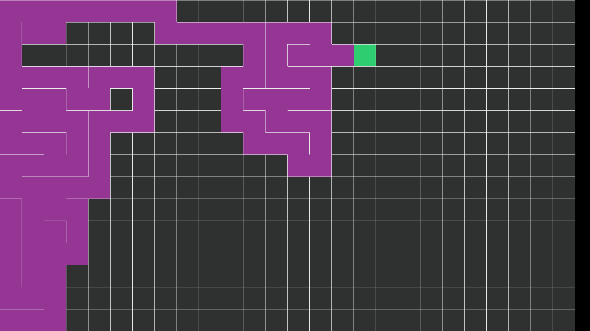

# Labyrinth Of Chaos
Created during my first year at DAE, Labyrinth Of Chaos was my first game made without an existing engine. The labyrinths are randomly generated using the "Randomized depth-first search" algorithm and then areas/walls removed to make large rooms, loot and enemies randomly distributed through the levels and a highscore system for those that are competitive. Whilst made in my first year there are still bits I am proud of and it also shows the progress I've made since then.

## Labyrinth generation
This script manages the generation of the labyrinth using the "Randomized depth-first search" algorithm, also known as the "recursive backtracker" algorithm. Implementing the algorithm really got me thinking about the visualisation of an algorithm and what they do.

```c++
int unvisitedTiles{ nrSize * nrSize - 1 };
std::vector<Cell*> stack{};
Cell* currentTile{ m_Cells[0] };
currentTile->Visited();

while (unvisitedTiles > 0)
{
    // Check if there are any tiles adjacent that haven't been visited
    if (currentTile->AreThereUnvisitedNeighbours(m_Cells))
    {
        // Gets the unvisited adjacent tiles
        std::vector<int> neighbours{};
        currentTile->GetUnvisitedNeighbours(m_Cells, neighbours);
        // Randomly select a tile to visit
        int neighboursId{ neighbours[int(rand() % neighbours.size())] };
        stack.push_back(currentTile);

        // Remove walls between the 2 tiles
        if (neighboursId - nrSize == currentTile->GetId())
        {
            currentTile->RemoveWall(Cell::Wall::top);
            m_Cells[neighboursId]->RemoveWall(Cell::Wall::bottom);
        }
        if (neighboursId + 1 == currentTile->GetId())
        {
            currentTile->RemoveWall(Cell::Wall::left);
            m_Cells[neighboursId]->RemoveWall(Cell::Wall::right);
        }
        if (neighboursId + nrSize == currentTile->GetId())
        {
            currentTile->RemoveWall(Cell::Wall::bottom);
            m_Cells[neighboursId]->RemoveWall(Cell::Wall::top);
        }
        if (neighboursId - 1 == currentTile->GetId())
        {
            currentTile->RemoveWall(Cell::Wall::right);
            m_Cells[neighboursId]->RemoveWall(Cell::Wall::left);
        }

        // Swap the active tile to the new one
        currentTile = m_Cells[neighboursId];
        currentTile->Visited();
        --unvisitedTiles;
    }
    // Backtrack to find an unvisited tile
    else if (!stack.empty())
    {
        currentTile = stack.back();
        stack.pop_back();
    }
}

// Create rooms in the labyrinth for more variety
CreateRooms();
```



## Room generation
Once the labyrinth was generated room were then added to it. This was done by selecting a random cell, destroying its walls then expanding outwards from there and repeating until you expanded enough.

```c++
void Level::CreateRoom(int iteration, int nrRooms, std::vector<int>& cellsUsed) const
{
	bool newCell{ true };
	int min{ 1 }, max{ nrSize - 2 };
	int row{}, col{};
	int randomCell{};

	// Loop for the number of rooms wanted
	for (int i{}; i < nrRooms; ++i)
	{
		do
		{
			// Select a random cell
			newCell = true;
			row = rand() % (max - min + 1) + min;
			col = rand() % (max - min + 1) + min;
			randomCell = utils::GetIndex(row, col, nrSize);

			// Check that it hasn't been used
			for (int element : cellsUsed)
			{
				if (element == randomCell)
				{
					newCell = false;
					break;
				}
			}
		} while (!newCell);

		cellsUsed.push_back(randomCell);

		// Delete all the walls recursively 
		DeleteWalls(iteration, randomCell);
	}
}

void Level::DeleteWalls(int iteration, int cellId) const
{
	// Clear the walls for the current cell
	m_Cells[cellId]->ClearAllWalls();
	// Stop the recursive when needed
	if (--iteration <= 0)
	{
		return;
	}

	// Get the neighbouring cells
	std::vector<int> neighbours{};
	m_Cells[cellId]->GetNeighbours(neighbours);

	// Recursively delete the walls
	for (int id : neighbours)
	{
		DeleteWalls(iteration, id);
	}
}
```
## Gameplay
<iframe width="560" height="315" src="https://www.youtube.com/embed/kl699b-OKXI" frameborder="0" allowfullscreen></iframe>

[Back](../index.html)
