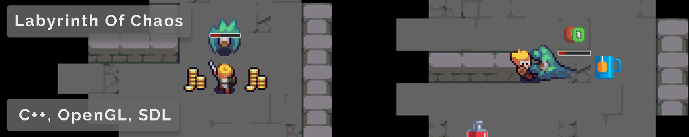

# Labyrinth Of Chaos
Created during my first year at DAE, Labyrinth Of Chaos was my first game made without an existing engine. The labyrinths are randomly generated using the "Randomized depth-first search" algorithm and then areas/walls removed to make large rooms, loot and enemies randomly distributed through the levels and a highscore system for those that are competitive. Whilst made in my first year there are still bits I am proud of and it also shows the progress I've made since then.

[Back](../index.html)
