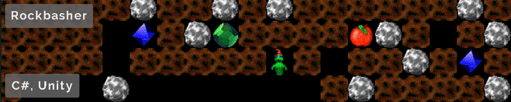
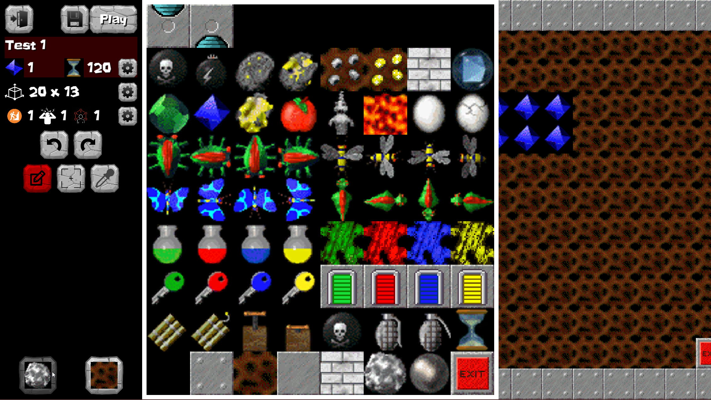
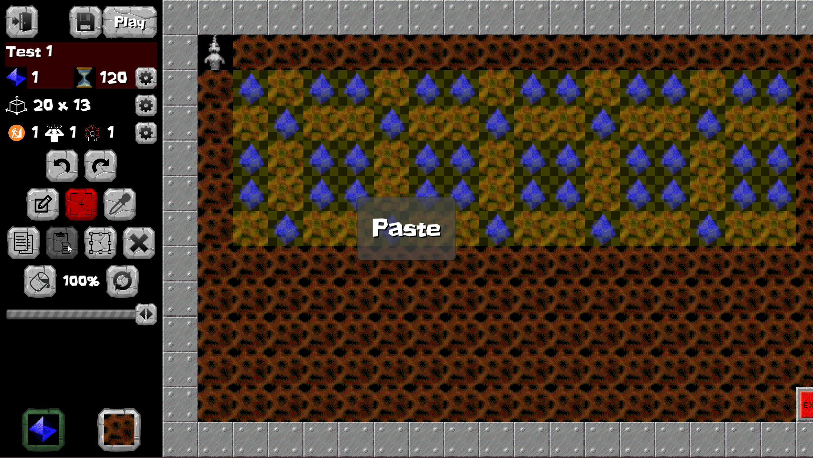
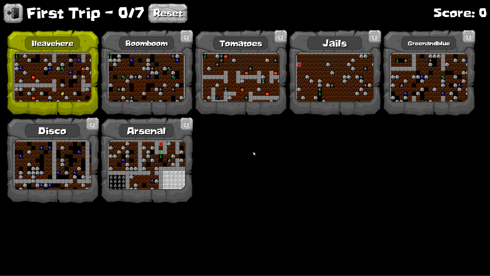
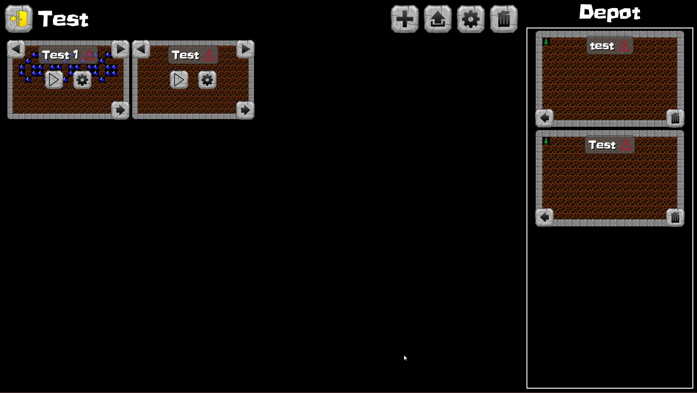

# Rockbasher
A game I worked on during an internship with 1 other person (original creator). It is a recreation of a game they made over 20 years ago. In the game, you play as a little worm dragon who must find diamonds in a cave to reach the exit and go to the next level. 

I was tasked with creating the following:
  - HUD - locked to a specific ratio
  - UI - keyboard navigation, list view of levels, level manager (reorder, reset progress, delete, etc...
  - Custom level loading from files
  - In-game level editor - copy, paste, painting of tiles, resizing, name, points, etc...
  - Downloading levels shared online - game to server interface

The Unity version was later on scrapped but an online version (found [here](https://www.rockbasher.com/)) does exist but I had zero part in the making of it.

[Back](../index.html)
