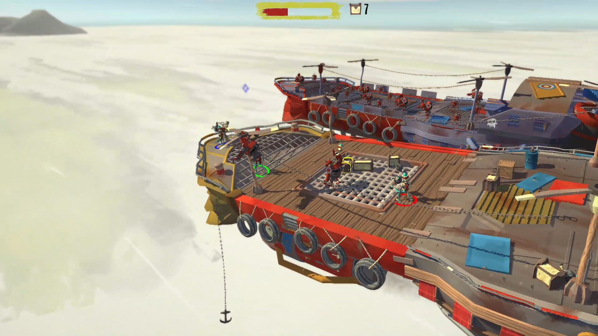
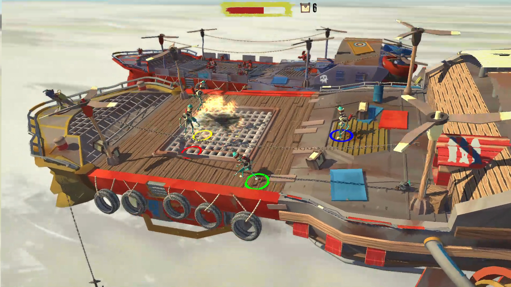
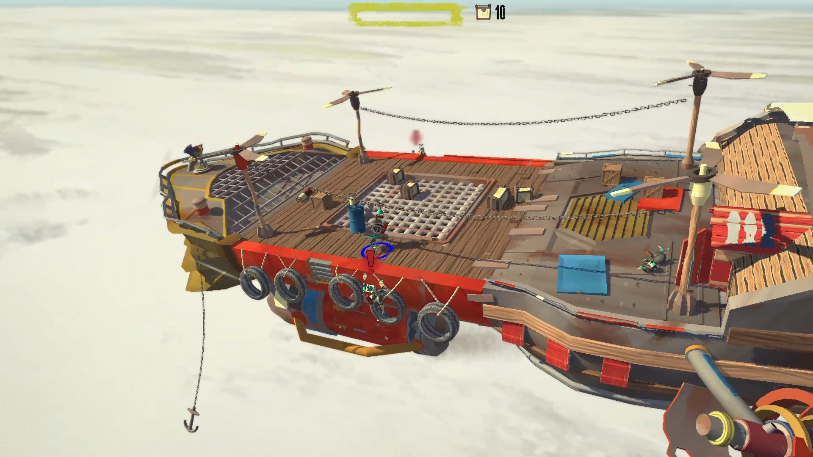

# Ship IT!
Ship IT! is the game that my team and I made during our Game Projects course at DAE. This is couch co-op game where, up to 4, brave delivery robots face hardship and perils to get their cargo to their destination. During their journey, they will be assailed by wandering robots trying to plunder their goods and gusts of winds threatening to throw them, or worse, their goods overboard.

Features I worked on:
  - Two different robot AIs
    1. Large robots that charge at the player knocking them back
    2. Small robots that try to push off the cargo
  - The large enemy ship that arrives with enemy robots
  - Implemented the animations for the robots
  - Outline shader to know which player has selected what
  - Tweaking of gameplay element to make the game feel right

## Trailer

    

        <iframe src="https://www.youtube.com/embed/NakeC8UaCZ4" frameborder="0" allowfullscreen></iframe>
    

