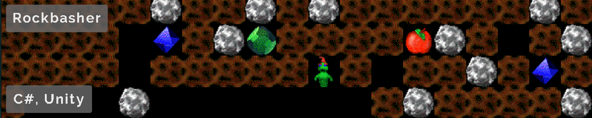
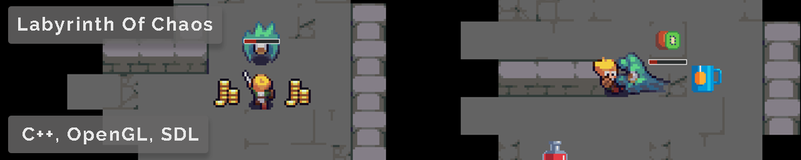

 

 

 

Ship IT! is the game that my team and I made during our Game Projects cours at DAE. In this couch coop game you play as 4 robots trying to keep their cargo from falling off a ship while fending off the incoming enemy robots.
For this project I programmed the enemy robots AI, created an object outline shader as well as tweeking and bug fixing.

 

A little VR demo developped for the HTC Vive when it first came out. The was done to see what the technologie could do as well as see if the schools computers could run the VR headset. This was the project that really got me interested in game dev and got me started me on this journey.

 

My name is Struan Forsyth, from Switzerland and am currently in my 3rd year at Digital Arts & Entertainment finishing up my major in Game Development.

When I got my first computer I was fascinated with how it worked. This initial intrigue was what lead me to where I am now. While studying how to make desktop/mobile applications and websites I got the chance to try developing something for VR, as an avid gamer this was a great opportunity to develop for new hardware. This was the final push needed to get me to pursue a game dev related field of study. Over the last 2 years, I've learned a lot about game dev and all tasks that are needed to make a game. 

### Hobbies
Mountain biking, Web/Light novel reading, Gaming, VR, Gamedev

### Contact me
* [struanforsyth@gmail.com](mailto:struanforsyth@gmail.com)
* [LinkedIn](https://www.linkedin.com/in/struan-forsyth-168a9294)