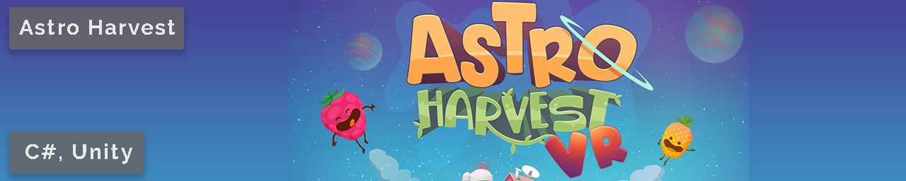

Astro harvest is a project I'm currently working on with a group of 2 artists, 3 game developers and 1 all-rounder. It's a VR game where you farm fruits, place turrets, man them with the fruits and upgrade to defend your base against alien invaders. The game is being developed for the Oculus Quest which comes with its own challenges for development. 
Features I'm currently implementing:
  - Alien AI
  - Fruit AI
  - Behaviour Tree
  - VR locomotion

[More details...](details/AstroHarvest.html)

 

This game was made using the engine created during a course at University. The original version of the engine, Overlord Engine, was very bare-bones and required the implementation of features using DirectX 11, HLSL and other frameworks/tools. I chose to recreate, with a twist, Wii Tanks as it was a challenging game to play and would offer me plenty of possibilities to add features.

[More details...](details/Tanks.html)

 

Created during my first year at DAE, Labyrinth Of Chaos was my first game made without an existing engine. The labyrinths are randomly generated using the "Randomized depth-first search" algorithm and then areas/walls removed to make large rooms, loot and enemies randomly distributed through the levels and a highscore system for those that are competitive.

[More details...](details/LabyrinthOfChaos.html)

 

A game I worked on during an internship with 1 other person (original creator). It is a recreation of a game they made over 20 years ago. In the game, you play as a little worm dragon who must find diamonds in a cave to reach the exit and go to the next level. 
I was tasked with creating the following:
  - HUD - locked to a specific ratio
  - UI - keyboard navigation, list view of levels, level manager (reorder, reset progress, delete, etc...
  - Custom level loading from files
  - In-game level editor - copy, paste, painting of tiles, resizing, name, points, etc...
  - Downloading levels shared online - game to server interface

[More details...](details/Rockbasher.html)

 

Ship IT! is the game that my team and I made during a Project at University. This is couch co-op game where, up to 4, brave delivery robots face hardship and perils to get their cargo to their destination. During their journey, they will be assailed by wandering robots trying to plunder their goods and gusts of winds threatening to throw them, or worse, their goods overboard.
For this project, I programmed the enemy robots AI, handled part of the animation implementation, created an object outline shader as well as tweaking gameplay elements and bug fixing.

[More details...](details/ShipIT.html)

 

A little VR demo developed for the HTC Vive when it first came out. The was done to see what the technology had to offer as well as see if the schools' computers could run the VR headset. This was the project that really got me interested in game dev and got me started on this journey.
This prototype was built with SteamVR and VRTK (Virtual Reality Toolkit). SteamVR was used for the specific headset provided, while VRTK was used for the multitude of functionality offered - interactable, locomotion, pointers, UI elements, etc.. VRTK would also facilitate other SDKs if the school would ever like to try using a different VR headset.

[More details...](details/VR_Prototype.html)

 

My name is Struan Forsyth, from Switzerland and am currently in my 3rd year at Digital Arts & Entertainment finishing up my major in Game Development.

When I got my first computer I was fascinated with how it worked. This initial intrigue was what lead me to where I am now. While studying how to make desktop/mobile applications and websites I got the chance to try developing something for VR, as an avid gamer this was a great opportunity to develop for new hardware. This was the final push needed to get me to pursue a game dev related field of study. Over the last 2 years, I've learned a lot about game dev and deepened my knowledge of all the tasks that are needed to make a game.

### Hobbies
Mountain biking, Web/Light novel reading, Gaming, VR, Gamedev

### Contact me
* [struanforsyth@gmail.com](mailto:struanforsyth@gmail.com)
* [LinkedIn](https://www.linkedin.com/in/struan-forsyth-168a9294)